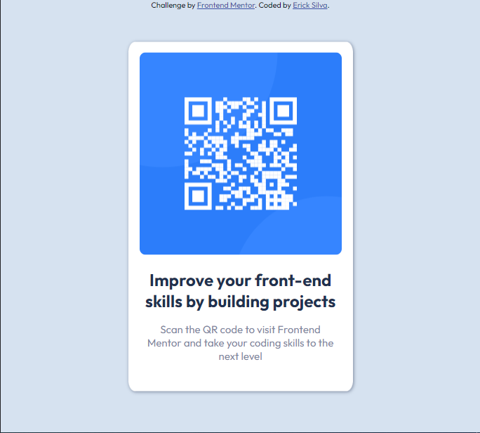

# Frontend Mentor - QR code component solution

This is a solution to the "QR code component challenge" on Frontend Mentor (https://www.frontendmentor.io/challenges/qr-code-component-iux_sIO_H). Frontend Mentor challenges help you improve your coding skills by building realistic projects. 

## Table of contents

- [Overview](#overview)
  - [Screenshot](#screenshot)
  - [Links](#links)
- [My process](#my-process)
  - [Built with](#built-with)

## Overview

### Screenshot

### Links

- Solution URL: (https://your-solution-url.com)
- Live Site URL: [Add live site URL here](https://your-live-site-url.com)

## My process
It was my first project since I have been studying for almost 3 months. I think I a lot to learn and much more to develop to code more efficiently and speed.

My biggerst difficults were positioning the container and centering all the elements.

### Built with

- Semantic HTML5 markup
- CSS custom properties
